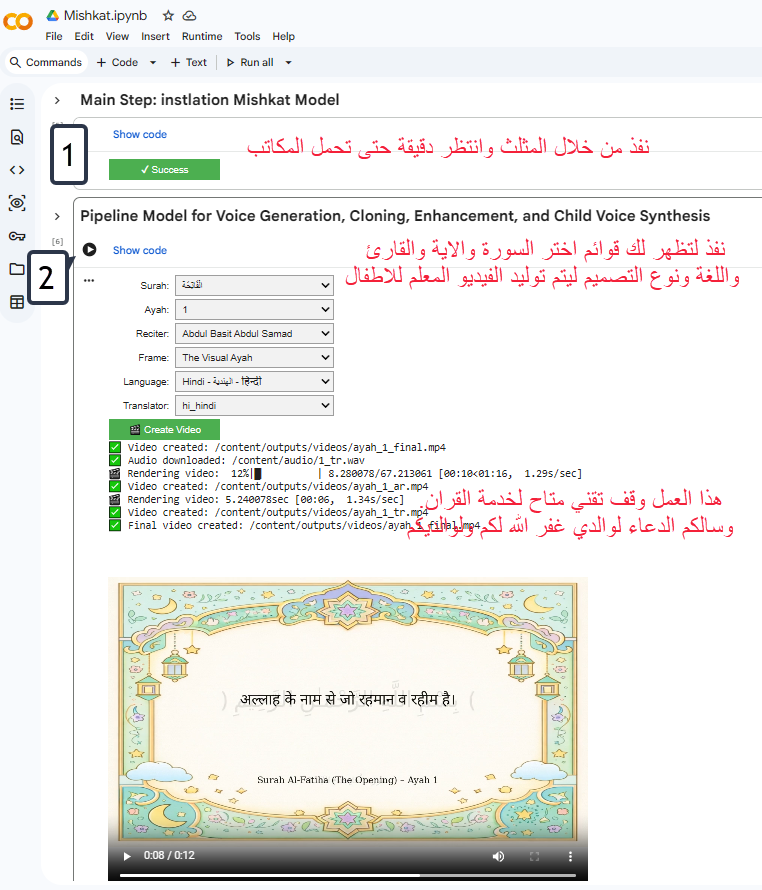
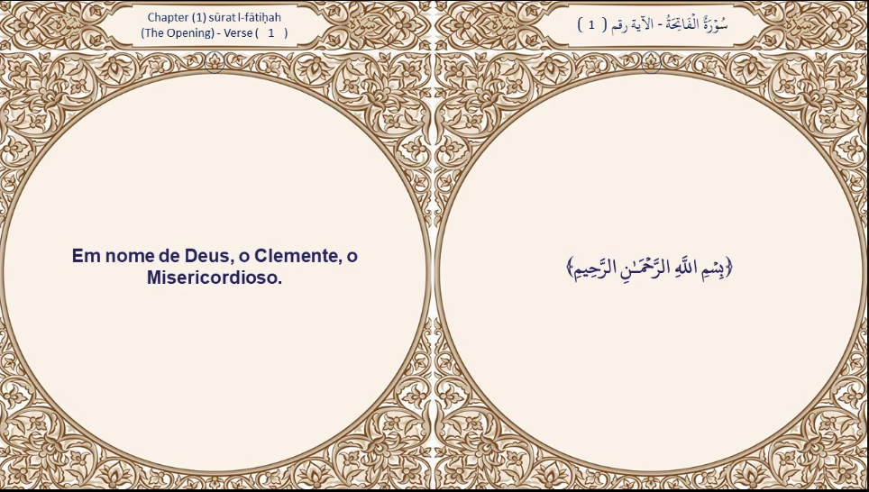

# 🕌 Mishkat: Multisensory Quranic Rendering Engine

[](https://www.python.org/)
[](LICENSE)
[](https://colab.research.google.com/drive/1Dac3M-vgOyNE7-8iCkRsw_4mk3SSIySJ?usp=sharing)
[]()

> **Mishkat** is the "Global Reach" arm of the **Bayan** ecosystem. It serves as a technical **Proof of Concept (PoC)** for transforming semantic understanding into **Context-Aware Audio** and visual experiences. It represents a pioneering model in **Disciplined Generative AI**, designed to bridge the emotional gap for non-Arabic speaking children.

---

## 📖 The Vision: Addressing the "Emotional Gap"

### 1. The Motivation: Bridging the Language Barrier via Intuition
Mishkat starts from a global civilizational challenge: *How do we connect a non-Arabic speaking child to the Quran before they master the language?*

We believe the Quran is not merely text to be read, but an **Experience**. Mishkat aims to address the "auditory and visual intuition" of the child. Our goal is not just to teach recitation, but to build an **early emotional bond**, making the child feel the Quran is addressing them in their mother tongue, with a familiar tone, transforming linguistic alienation into emotional familiarity.

### 2. The Technical Gap: Taming "Blind" Generative AI
Despite the GenAI revolution, current applications suffer from "Cognitive Disconnect":
*   **The Problem:** Current Text-to-Video and TTS tools act as "black boxes," isolated from the sanctity and context of the Quranic text, often producing random or spiritually inappropriate content.
*   **The Challenge:** How do we tame these wild models to build a **Controlled Pipeline** that generates audio-visual content derived from a deep semantic understanding of the Ayah, rather than superficial generation?

---

## 🛠️ System Architecture & Innovation

Mishkat introduces the first engineering framework for **Multisensory Quranic Rendering**.

### 🧩 The Pipeline Components

1.  **Emotional Voice Cloning (via Ilqa):**
    We utilize our sister project, **[Ilqa](https://github.com/NoorBayan/Ilqa)**, to handle the audio generation pipeline.
    *   **Innovation:** Developing TTS models that simulate a **"Child Persona"**.
    *   **Impact:** Presenting Quranic translations in the child's native language (English, French, etc.) using a voice they identify with, creating immediate psychological resonance.

2.  **Scalable Production Pipeline:**
    To prove the infrastructure's robustness, we have moved beyond sampling. We have successfully automated the generation of over **140,000 video clips** covering full Qurans in **20 global languages** (out of 83 targeted). This demonstrates immediate **Global Scalability**.

---

## 🎮 Interactive Demo & Usage

We provide a **Google Colab Notebook** as a prototype to demonstrate the generation capabilities.

### [🚀 Launch Mishkat Demo in Colab](https://colab.research.google.com/drive/1Dac3M-vgOyNE7-8iCkRsw_4mk3SSIySJ?usp=sharing)

#### 1. How to Use
Select the Surah, Ayah, Reciter, Language, and Visual Template to generate a video instantly.


*(Figure 1: Step-by-step guide to generating a video using the Colab interface)*

#### 2. Visual Templates
Mishkat supports dynamic visual themes (e.g., "Quran Garden", "Sky & Stars", "Flashcards") to suit different educational contexts.


*(Figure 2: Examples of different visual templates generated by the engine)*

---

## ⚖️ Research Impact & Reliability

Mishkat establishes a new standard for **AI for Faith-Based Education**:

*   **Meaning-Rendering Separation:** The system strictly separates *Authoritative Meaning* (approved translations) from *Sensory Rendering* (Audio/Video). The AI **never** generates the translation text itself; it only renders approved data.
*   **Controlled Generative Pipeline:** All outputs undergo strict semantic constraints. The AI's role is limited to educational representation, not interpretation.
*   **Precomputed Scalability:** Due to the high computational cost of emotional cloning and visual alignment, we adopted a pre-computation strategy, resulting in ~140,000 ready-to-stream assets.
*   **PoC for Future Systems:** This pipeline serves as the foundation for future "Context-Aware Audio" systems capable of coloring audio performance based on meaning (Sadness, Glad Tidings, Warning) under human supervision.

---

## 🚀 Installation (Local Development)

To run the pipeline locally instead of on Colab:

```bash
# 1. Clone the repository
git clone https://github.com/YourOrg/Mishkat.git
cd Mishkat

# 2. Install dependencies
pip install -r requirements.txt

# 3. Install system requirements (Linux/Ubuntu)
sudo apt-get install libreoffice ffmpeg

# 4. Run the pipeline (Example)
python -m src.pipeline.create_ayah_video
```

---

## 🤝 Contributing

We welcome contributions, especially in expanding the `templates/` library or optimizing the FFmpeg rendering parameters.

1.  Fork the repository.
2.  Create your feature branch (`git checkout -b feature/NewTemplate`).
3.  Commit your changes.
4.  Push to the branch.
5.  Open a Pull Request.

---

## 📄 License

This project is licensed under the MIT License - see the [LICENSE](LICENSE) file for details.

---

<p align="center">
  <strong>Mishkat</strong> part of the <strong>Bayan</strong> Ecosystem.<br>
  <em>Bridging the gap between Sacred Text and Human Emotion.</em>
</p>
